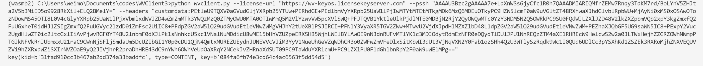

```bash
__        ____     ______ _ _            _   _____ 
\ \      / /\ \   / / ___| (_) ___ _ __ | |_|___ / 
 \ \ /\ / /  \ \ / / |   | | |/ _ \ '_ \| __| |_ \ 
  \ V  V /    \ V /| |___| | |  __/ | | | |_ ___) |
   \_/\_/      \_/  \____|_|_|\___|_| |_|\__|____/ 
```

---

[ENGLISH README](README_ENG.md)

# WVClient3

原项目是[NoDRM](https://github.com/T3rry7f/NoDRM)（WVClient续作，适配2209版本），感谢T3rry7f。

WVClient3从它修改而来，增加了一些细节。

# 使用

如果是win系统并且用的3.7.4/3.7.10/3.8.5版本的python，可以跳过下面的编译

### 编译python的cdmapi库

**记得先安装`Visual Studio`，这样才能正常编译**

```bash
cd cdmapi-python-extension-src
python setup.py build_ext --inplace
```

编译成功之后将`cdmapi.cp38-win_amd64.pyd`移动到`pywidevine/cdm`下并重命名为 `cdmapi.pyd`

如果用的不是Windows系统，先编译`cryptopp`的静态库

-  https://github.com/weidai11/cryptopp

然后把编译产物放放到`cdmapi-python-extension-src`下面，然后修改`setup.py`里面的**extra_objects**

如果是3.7.10及以上的python，编译`cryptopp`的时候应该选`/MD`，即多线程dll

3.7.4则选`/MT`，即多线程

3.7.10以下，除3.7.4外的其他版本没有测试，应该都是`/MT`

## 安装requirements.txt

```bash
pip install -r requirements.txt
```

## 命令示例

```bash
python wvclient.py --license-url "https://wv-keyos.licensekeyserver.com" --pssh "AAAAU3Bzc2gAAAAA7e+LqXnWSs6jyCfc1R0h7QAAADMIARIQMfrZEMw7Rnqy3TdKM7rd/BoLYnV5ZHJta2V5b3MiED5o9928RkXil+ELQ2BMelY=" --headers "customdata:PEtleU9TQXV0aGVudGljYXRpb25YTUw+PERhdGE+PEdlbmVyYXRpb25UaW1lPjIwMTYtMTEtMTkgMDk6MzQ6MDEuOTkyPC9HZW5lcmF0aW9uVGltZT48RXhwaXJhdGlvblRpbWU+MjAyNi0xMS0xOSAwOTozNDowMS45OTI8L0V4cGlyYXRpb25UaW1lPjxVbmlxdWVJZD4wZmZmMTk3YWQzMzQ0ZTMyOWU0MTA0OTIwMmQ5M2VlYzwvVW5pcXVlSWQ+PFJTQVB1YktleUlkPjdlMTE0MDBjN2RjY2QyOWQwMTc0YzY3NDM5N2Q5OWRkPC9SU0FQdWJLZXlJZD48V2lkZXZpbmVQb2xpY3kgZmxfQ2FuUGxheT0idHJ1ZSIgZmxfQ2FuUGVyc2lzdD0iZmFsc2UiIC8+PFdpZGV2aW5lQ29udGVudEtleVNwZWMgVHJhY2tUeXBlPSJIRCI+PFNlY3VyaXR5TGV2ZWw+MTwvU2VjdXJpdHlMZXZlbD48L1dpZGV2aW5lQ29udGVudEtleVNwZWM+PEZhaXJQbGF5UG9saWN5IC8+PExpY2Vuc2UgdHlwZT0ic2ltcGxlIiAvPjwvRGF0YT48U2lnbmF0dXJlPk1sNnhkcU5xc1VNalNuMDdicU8wME15bHhVZUZpeERXSHB5WjhLWElBYlAwOE9nN3dnRUFvMTlYK1c3MDJOdytRdmEzNFR0eDQydTlDUlJPU1NnREQzZTM4aXE1RHREcW9HelcwS2w2a0JLTWxHejhZZGRZOWhNWmpPTGJkNFVkRnJUbmxxU21raC9CWnNjSFljSmdaUm5DcUZIbGI1Y0p0cDU1QjN4QmtxMUREZUEydnJUNEVVcVJiM3YyV1NueUhGeVZqWDhCR3o0ZWFwZmVFeDlxSitKbWI3dUt3VjNqVXN2Y0Fab1ozSHh4QzU3WTlySzRqdk9Wc1I0QUd6UDlCc3pYSXhKd1ZSZEk3RXRoMjhZNXVEQUVZVi9hZXRxdWZiSXIrNVZOaE9yQ2JIVjhrR2praDhHRE43dC9nYWh6OWhVeUdOaXRqY2NCekJvZHRnaXdSUT09PC9TaWduYXR1cmU+PC9LZXlPU0F1dGhlbnRpY2F0aW9uWE1MPg=="
```



## 帮助信息

```bash
usage: wvclient3 v1.3@xhlove [-h] [--pssh PSSH] [--init-path INIT_PATH] [--init-url INIT_URL] [--mpd-url MPD_URL] [--license-url LICENSE_URL] [--headers HEADERS]

origin author is T3rry7f, this is a python3 version.

optional arguments:
  -h, --help            show this help message and exit
  --pssh PSSH           pssh which is base64 format
  --init-path INIT_PATH
                        init.mp4 file path
  --init-url INIT_URL   init.mp4 segment url
  --mpd-url MPD_URL     mpd url
  --license-url LICENSE_URL
                        widevine license server url
  --headers HEADERS     set custom headers for request, separators is |, e.g. "header1:value1|header2:value2"
```